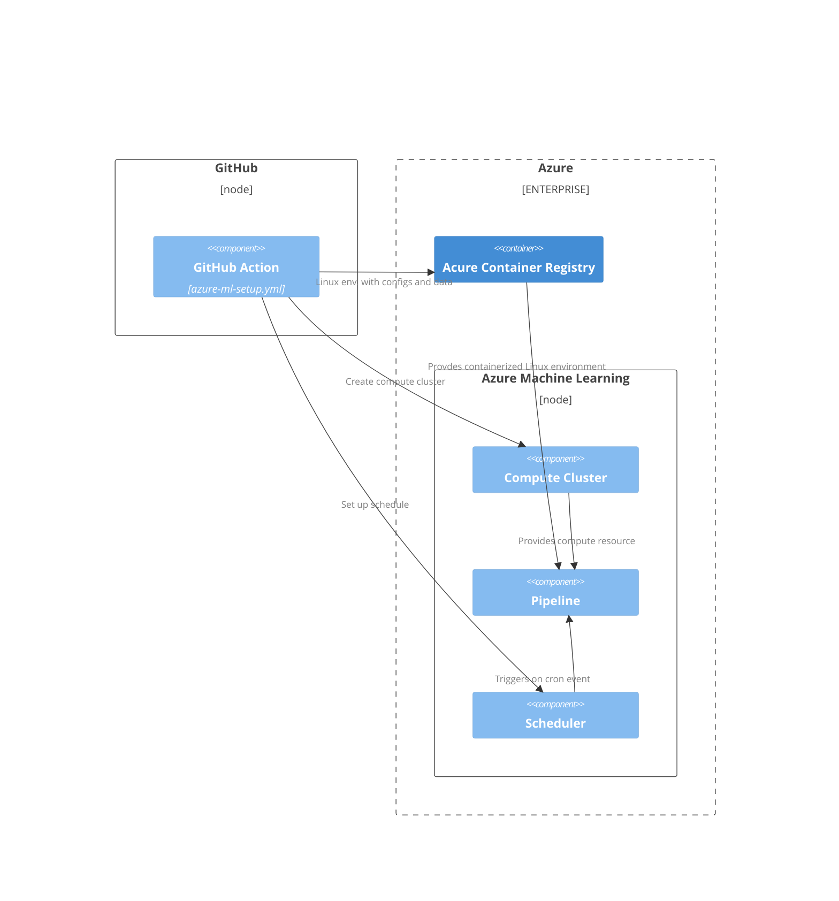
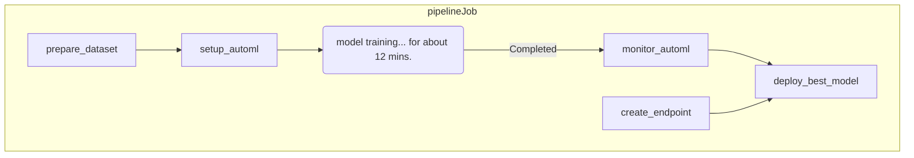

# Azure-ML-automation-research

#### Create a dedicated Service Principal for the project

```bash
    az ad sp create-for-rbac --name "{SERVICE_PRINCIPAL_NAME}" \
     --role contributor \
     --scopes /subscriptions/{SUBSCRIPTION_ID} \
     --sdk-auth
```
> This will then return a response of credentials in JSON format. Save the JSON as a repository secret with the name of `AZURE_CREDENTIALS`, which will then later be used in Azure CLI login in the GitHub workflow. 

### `pipelineJob` Definition


### Tasks of `pipelineJob` in details

### Result view of pipeline run 


